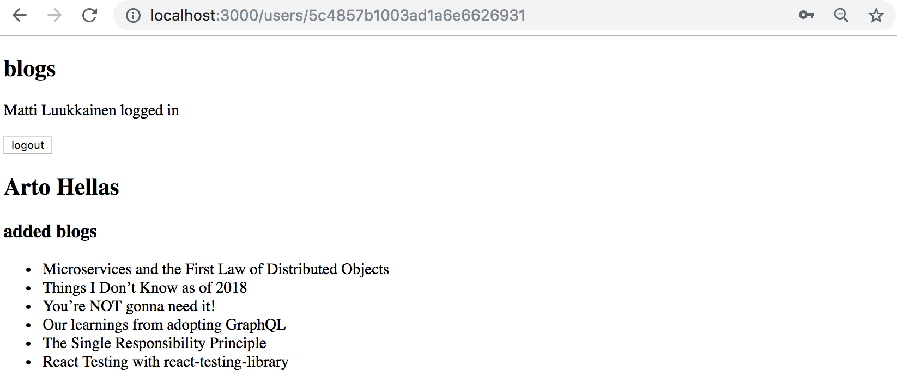
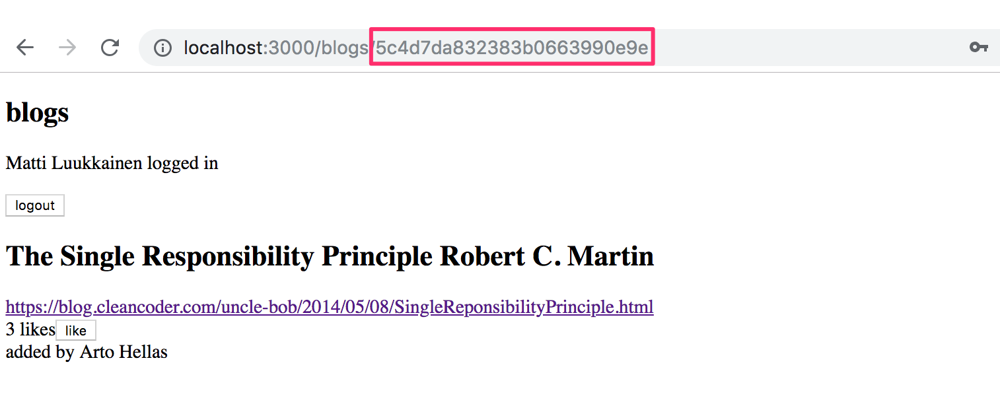
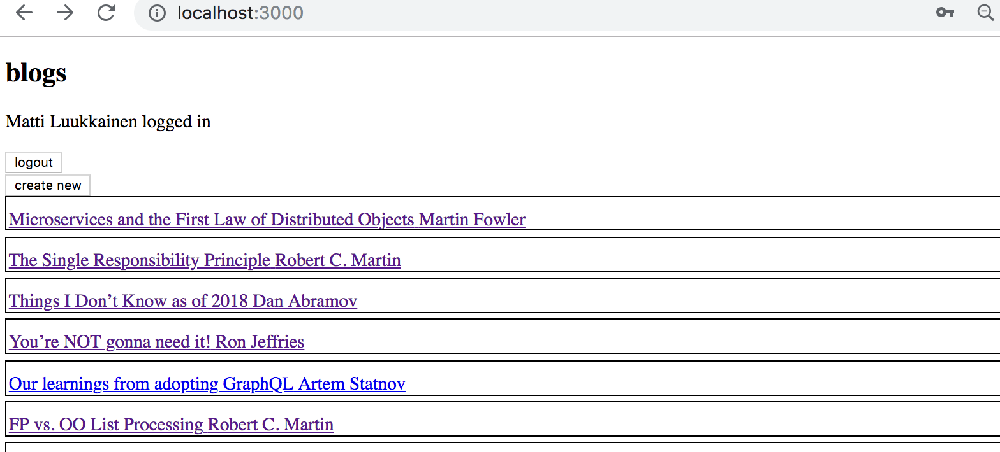
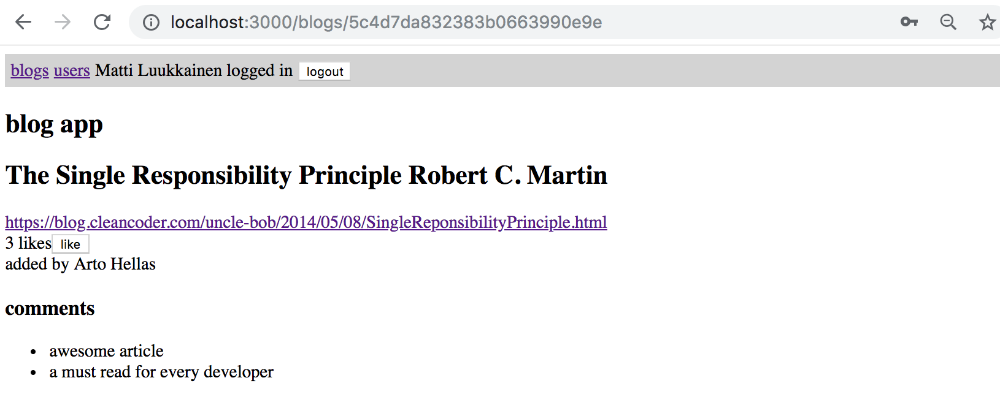
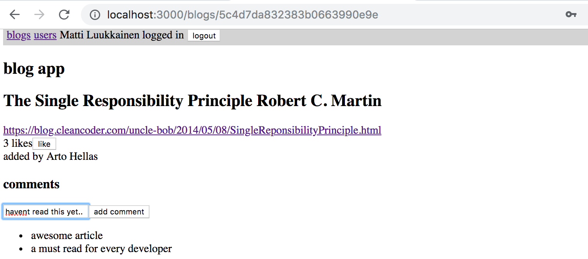

<div class="content">


<!-- In addition to the eight exercises in the [React router](/zh/part7/react_router) and [custom hooks](/zh/part7/custom_hooks) sections of this seventh part of the course material, there are 13 exercises that continue our work on the Bloglist application that we worked on in parts four and five of the course material. Some of the following exercises are "features" that are independent of one another, meaning that there is no need to finish the exercises in any particular order. You are free to skip over a part of the exercises if you wish to do so. -->
除了课程材料第七章节[React router](/zh/part7/react_router) 和[custom hooks](/zh/part7/custom_hooks)的八个练习之外，还有13个练习继续我们在课程材料第四章节和第五章节所做的 Bloglist 应用的工作。 下面的一些练习是相互独立的“特征” ，这意味着没有必要按照任何特定的顺序完成练习。 如果你愿意，你可以跳过这些练习的一部分。

<!-- If you do not want to use your own Bloglist application, you are free to use the code from the model solution as a starting point for these exercises. -->
如果您不想使用您自己的 Bloglist 应用，您可以自由地使用模型解决方案中的代码作为这些练习的起点。

<!-- Many of the exercises in this part of the course material will require the refactoring of existing code. This is a common reality of extending existing applications, meaning that refactoring is an important and necessary skill even if it may feel difficult and unpleasant at times. -->
课程教材这一章节的许多练习将需要重构现有的代码。 这是扩展现有应用的一个普遍现实，这意味着重构是一项重要且必要的技能，即使有时可能会感到困难和不愉快。

<!-- One good piece of advice for both refactoring and writing new code is to take <i> baby steps</i>. Losing your sanity is almost guaranteed if you leave the application in a completely broken state for long periods of time while refactoring. -->
对于重构和编写新代码，一个很好的建议是采取小步迭代。 如果在重构过程中让应用长时间处于完全崩溃的状态，那么几乎肯定会失去控制。

</div>


<div class="tasks">


### Exercises 7.9.-7.21.
#### 7.9: redux, 步骤1
<!-- Refactor the application from using internal React component state to using Redux for the application's state management. -->
将应用从使用内部 React 组件状态重构为使用 Redux 进行应用的状态管理。

<!-- Change the application's notifications to use Redux at this point of the exercise set. -->
在练习中，使用 Redux更改应用的通知机制。

#### 7.10: redux, 步骤2
<!-- _Note_ that this and the next two exercises are quite laborious but incredibly educational. -->
请注意，这个和接下来的两个练习相当费力，但有令人难以置信的学习价值。

<!-- Store the information about blog posts in the Redux store. In this exercise it is enought that you can see the blogs in backend and create a new blog. -->
在 Redux store中存储有关博客文章的信息。 在这个练习中，你可以看到后台的博客，并创建一个新的博客。

<!-- You are free to manage the state for logging in and creating new blog posts by using the internal state of React components. -->
通过使用 React 组件的内部状态，您可以自由地管理登录和创建新博客文章的状态。

#### 7.11: redux, 步骤3
<!-- Expand your solution so that it is again possible to like and delete a blog. -->
展开您的解决方案，这样就可以再次喜欢和删除博客。

<!-- Laajenna ratkaisua siten, että blogien liketys ja poisto toimivat. -->
这是一个很好的例子，这是一个很好的例子。

#### 7.12: redux, 步骤4
<!-- Store the information about the signed in user in the Redux store. -->
在 Redux 存储中存储有关已签名用户的信息。

#### 7.13: Users view
<!-- Implement a view to the application that displays all of the basic information related to users: -->
实现应用的视图，该视图显示与用户相关的所有基本信息:


#### 7.14: Individual user view
<!-- Implement a view for individual users, that displays all of the blog posts added by that user: -->
为个人用户实现一个视图，显示该用户添加的所有博客文章:




<!-- You can access the view by clicking the name of the user in the view that lists all users: -->
您可以通过单击列出所有用户的视图中的用户名来访问该视图:


<i>**NB:**</i> you will almost certainly stumble across the following error message during this exercise:
注意: 在这个练习中，你几乎肯定会发现如下错误消息:


<!-- The error message will occur if you refresh the page for an individual user. -->
如果为单个用户刷新页面，将出现错误消息。

<!-- The cause of the issue is that when we navigate directly to the page of an individual user, the React application has not yet received the data from the backend. One solution for fixing the problem is to use conditional rendering: -->
问题的原因是，当我们直接导航到单个用户的页面时，React 应用尚未从后端接收数据。 解决这个问题的一个方法是使用条件渲染:

```js
const User = () => {
  const user = ...
  // highlight-start
  if (!user) {
    return null
  }
  // highlight-end

  return (
    <div>
      // ...
    </div>
  )
}
```

#### 7.15: Blog view
<!-- Implement a separate view for blog posts. You can model the layout of your view after the following example: -->
为博客文章实现一个单独的视图。你可以在下面的例子之后建模你的视图布局:




<!-- Users should be able to access the view by clicking the name of the blog post in the view that lists of all of the blog posts. -->
用户应该能够通过单击视图中所有博客文章列表中的博客文章的名称来访问该视图。




<!-- After you're done with this exercise, the functionality that was implemented in exercise 5.6 is no longer necessary. Clicking a blog post no longer needs to expand the item in the list and display the details of the blog post. -->
完成这个练习之后，练习5.6中完成的功能就不再需要。点击一个博客不再在列表中展开，而是在博客详情页中展示。

#### 7.16: Navigation
<!-- Implement a navigation menu for the application: -->
为应用实现一个导航菜单:


#### 7.17: comments, 步骤1
<!-- Implement the functionality for commenting on blog posts: -->
实现评论博客文章的功能:




<!-- Comments should be anonymous, meaning that they are not associated to the user who left the comment. -->
便笺应该是匿名的，这意味着它们与留下便笺的用户没有关联。

<!-- In this exercise it is enough for the frontend to only display the comments that the application receives from the backend. -->
在这个练习中，前端只显示应用从后端接收到的便笺就足够了。

<!-- An appropriate mechanism for adding comments to a blog post would be an HTTP POST request to the <i>api/blogs/:id/comments</i> endpoint. -->
向博客文章添加评论的适当机制是向<i>api/blogs/:id/comments</i>  接口发送 HTTP POST 请求。

#### 7.18: comments, 步骤2
<!-- Extend your application so that users can add comments to blog posts from the frontend: -->
扩展你的应用，让用户可以从前端向博客文章添加评论:




#### 7.19: Styles, 步骤1
<!-- Improve the appearance of your application by applying one of the methods shown in the course material. -->
通过应用课程材料中显示的方法之一来改善应用的外观。

#### 7.20: Styles, 步骤2
<!-- You can mark this exercise as finished if you use an hour or more for styling your application. -->
如果您使用了一个小时或更多的时间来设计应用，则可以将此练习标记为已完成。

#### 7.21: Course feedback
<!-- How did we do? Give us some feedback for the course in Moodle! -->
我们做的怎么样? 给我们一些关于 Moodle 课程的反馈！

<!-- This was the last exercise for this part of the course and it's time to push your code to GitHub and mark all of your finished exercises to the [exercise submission system](https://study.cs.helsinki.fi/stats/courses/fullstack2021). -->
这是本课程这一章节的最后一个练习，现在是时候把你的代码推送到 GitHub，并将所有完成的练习标记到[练习提交系统](https://study.cs.helsinki.fi/stats/courses/fullstack2021)。

</div>

